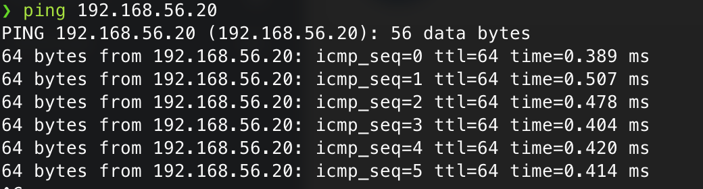
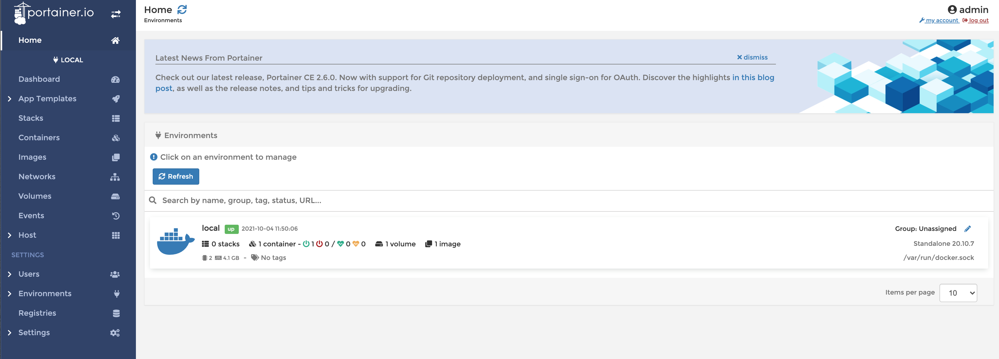
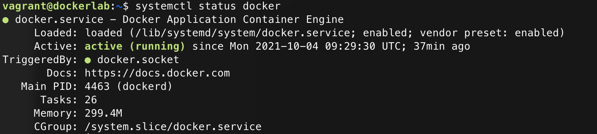
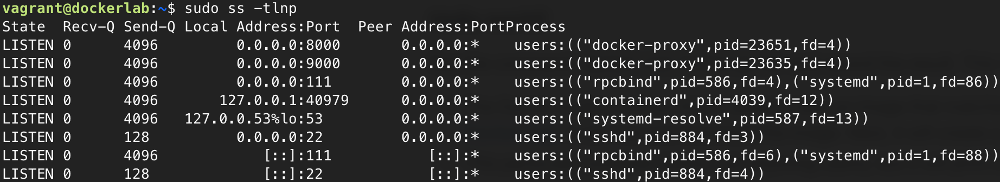
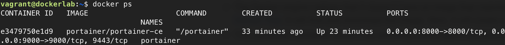

# Lab Report: Container Virtualization

## 1.1 Set up the test environment

- Run `vagrant up dockerlab` (make sure the Docker service is started!)
  
```console
PLAY RECAP *********************************************************************
dockerlab                  : ok=12   changed=1    unreachable=0    failed=0    skipped=0    rescued=0    ignored=0
```

You should now be able to ping the machine using `ping 192.168.56.20`



### Portainer

Sign in using admin and your own password, in this case I am using `Admin123*`.
Next up you have to connect your portainer to the container environment you want to manage, choose **Docker** and click **Connect**.

The next page should show the local endpoint



### Managing Docker from the CLI

Log in to the dockerlab VM using `vagrant ssh dockerlab`

Run following commands to check if the docker instance is running correctly:

- `systemctl status docker`
  - 
- `sudo ss -tlnp`
  - 
- `docker ps`
  - 
- `docker images`
  - 

## 1.2 Setting up our first containers

Run the command `docker run hello-world`, if docker can't find it locally, it will download it from the hub.

```console
vagrant@dockerlab:~$ docker run hello-world
Unable to find image 'hello-world:latest' locally
latest: Pulling from library/hello-world
2db29710123e: Pull complete
Digest: sha256:9ade9cc2e26189a19c2e8854b9c8f1e14829b51c55a630ee675a5a9540ef6ccf
Status: Downloaded newer image for hello-world:latest

Hello from Docker!
```

The difference between `docker ps` and `docker ps -a`:

```console
vagrant@dockerlab:~$ docker ps
CONTAINER ID   IMAGE                    COMMAND        CREATED          STATUS          PORTS                                                      NAMES
e3479750e1d9   portainer/portainer-ce   "/portainer"   44 minutes ago   Up 34 minutes   0.0.0.0:8000->8000/tcp, 0.0.0.0:9000->9000/tcp, 9443/tcp   portainer
vagrant@dockerlab:~$ docker ps -a
CONTAINER ID   IMAGE                    COMMAND        CREATED          STATUS                     PORTS                                                      NAMES
5b58cdc81407   hello-world              "/hello"       2 minutes ago    Exited (0) 2 minutes ago                                                              gracious_mahavira
e3479750e1d9   portainer/portainer-ce   "/portainer"   44 minutes ago   Up 34 minutes              0.0.0.0:8000->8000/tcp, 0.0.0.0:9000->9000/tcp, 9443/tcp   portainer
```

Remove the hello-world image, first remove the container before removing the image since it's still using it.

```console
vagrant@dockerlab:~$ docker rm 5b58cdc81407
5b58cdc81407
vagrant@dockerlab:~$ docker rmi hello-world
Untagged: hello-world:latest
Untagged: hello-world@sha256:9ade9cc2e26189a19c2e8854b9c8f1e14829b51c55a630ee675a5a9540ef6ccf
Deleted: sha256:feb5d9fea6a5e9606aa995e879d862b825965ba48de054caab5ef356dc6b3412
Deleted: sha256:e07ee1baac5fae6a26f30cabfe54a36d3402f96afda318fe0a96cec4ca393359
```

### Interactive and detached containers

Launch an Alpine container interactively (`-i`) and open a shell (`-t`)
`docker run -i -t --name alpine alpine`

On the `dockerlab` VM, enter following commands:

- `docker container ls`
  - It will show the running containers (alpine and portainer)
  
    ```console
    CONTAINER ID   IMAGE                    COMMAND        CREATED             STATUS          PORTS                                                      NAMES
    a964d7752fdd   alpine                   "/bin/sh"      2 minutes ago       Up 2 minutes                                                               alpine
    e3479750e1d9   portainer/portainer-ce   "/portainer"   About an hour ago   Up 51 minutes   0.0.0.0:8000->8000/tcp, 0.0.0.0:9000->9000/tcp, 9443/tcp   portainer
    ```

- `docker inspect alpine`
  - It will show all specific configuration settings of the Alpine Linux instance
- `docker top alpine`
  - This command provides information about the CPU, memory and swap usage.

    ```console
    UID                 PID                 PPID                C                   STIME               TTY                 TIME                CMD
    root                24585               24562               0                   10:33               pts/0               00:00:00            /bin/sh
    ```

Now exit the Alpine machine using `exit`, when executing the previous commands again on the dockerlab VM you will see that Alpine Linux is not running anymore.

Now we will launch the container in the background, first delete the container using `docker rm alpine`
Next you will run following command

```console
vagrant@dockerlab:~$ docker run -t -i -d --name alpine alpine
edd8a7b5f469eee510448d5564d08d52c0ba77eff051e95f1a478f06bf6a8ecd
```

Execute following commands to execute a command inside the Alpine container since it's not reachable due to it running in the background.

```console
vagrant@dockerlab:~$ docker exec -t alpine /bin/hostname
edd8a7b5f469
vagrant@dockerlab:~$ docker exec -t alpine /sbin/ip a
1: lo: <LOOPBACK,UP,LOWER_UP> mtu 65536 qdisc noqueue state UNKNOWN qlen 1000
    link/loopback 00:00:00:00:00:00 brd 00:00:00:00:00:00
    inet 127.0.0.1/8 scope host lo
       valid_lft forever preferred_lft forever
16: eth0@if17: <BROADCAST,MULTICAST,UP,LOWER_UP,M-DOWN> mtu 1500 qdisc noqueue state UP
    link/ether 02:42:ac:11:00:02 brd ff:ff:ff:ff:ff:ff
    inet 172.17.0.2/16 brd 172.17.255.255 scope global eth0
       valid_lft forever preferred_lft forever
vagrant@dockerlab:~$ docker exec -i -t alpine /bin/sh
/ #
```

Ping from the dockerlab VM to Alpine (ip **172.17.0.2**)

```console
vagrant@dockerlab:~$ ping 172.17.0.2
PING 172.17.0.2 (172.17.0.2) 56(84) bytes of data.
64 bytes from 172.17.0.2: icmp_seq=1 ttl=64 time=0.072 ms
64 bytes from 172.17.0.2: icmp_seq=2 ttl=64 time=0.056 ms
64 bytes from 172.17.0.2: icmp_seq=3 ttl=64 time=0.047 ms
```

Check if the container is still running even after exitting the shell

```console
vagrant@dockerlab:~$ docker ps
CONTAINER ID   IMAGE                    COMMAND        CREATED             STATUS             PORTS                                                      NAMES
edd8a7b5f469   alpine                   "/bin/sh"      6 minutes ago       Up 6 minutes                                                                  alpine
e3479750e1d9   portainer/portainer-ce   "/portainer"   About an hour ago   Up About an hour   0.0.0.0:8000->8000/tcp, 0.0.0.0:9000->9000/tcp, 9443/tcp   portainer
```

As you can see it is still running because we executed the container in the background.

Now stop the container and delete it.

```console 
vagrant@dockerlab:~$ docker stop alpine
alpine
vagrant@dockerlab:~$ docker rm alpine
alpine
```

## Resources

List all sources of useful information that you encountered while completing this assignment: books, manuals, HOWTO's, blog posts, etc.
